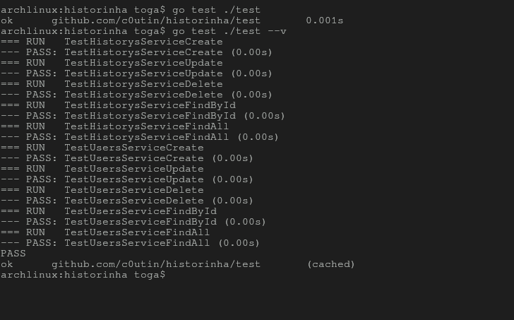

# Historinhas

Historinhas is a web application designed to create and manage short stories. It provides a platform where users can write, save, update, and delete their stories.

## Features

- **Create**: Users can create new stories by providing a title and content.
- **Update**: They can update existing stories by modifying their title or content.
- **Delete**: Users can delete stories they no longer want to keep.
- **Read**: They can view all stories or read individual stories.

## Technologies Used

- **Go (Golang)**: Backend language used for server-side development.
- **Gin**: Web framework used to handle HTTP requests and responses.
- **GORM**: Object-relational mapping (ORM) library for database interactions.
- **SQLite**: Lightweight database used for storing user data.
- **dotenv**: Library for managing environment variables.
- **Swagger**: API documentation tool for documenting endpoints.


## API Documentation

- The API documentation is available at `http://localhost:42069/docs`

## Usage

1. **Create a Story**:
   - Endpoint: `POST /histories`
   - Request body:
     ```json
     {
         "name": "Story Title",
         "history": "Story Content",
         "userID": 1
     }
     ```

2. **Update a Story**:
   - Endpoint: `PUT /histories/:historyId`
   - Request body:
     ```json
     {
         "name": "Updated Story Title",
         "history": "Updated Story Content",
         "userID": 1
     }
     ```

3. **Delete a Story**:
   - Endpoint: `DELETE /histories/:historyId`

4. **Get All Stories**:
   - Endpoint: `GET /histories`

5. **Get a Story by ID**:
   - Endpoint: `GET /histories/:historyId`

## Contributing

Contributions are welcome! Feel free to submit issues and pull requests.

## License

This project is licensed under the [MIT License](LICENSE).

# assets 



